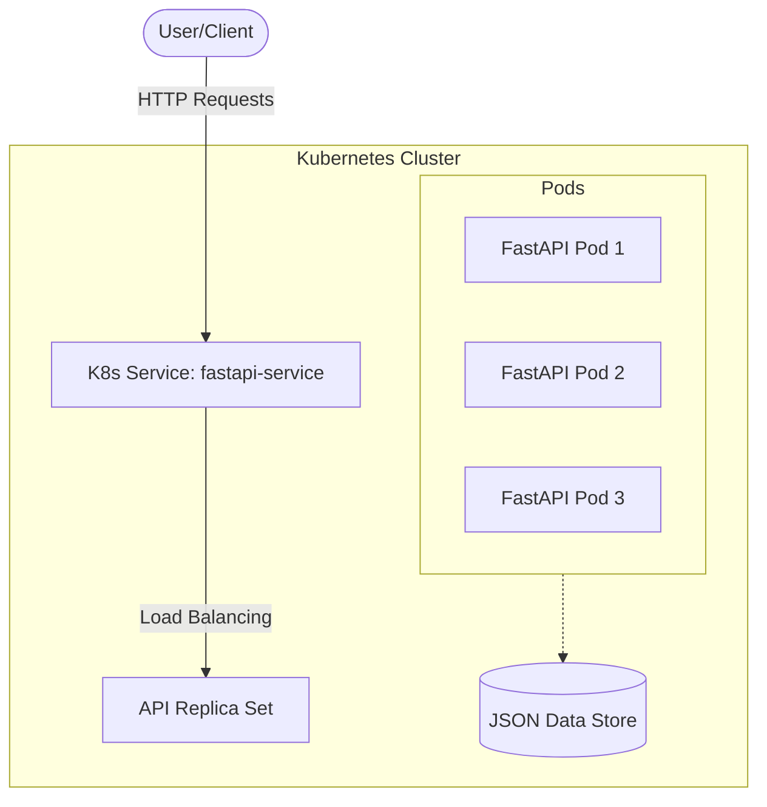
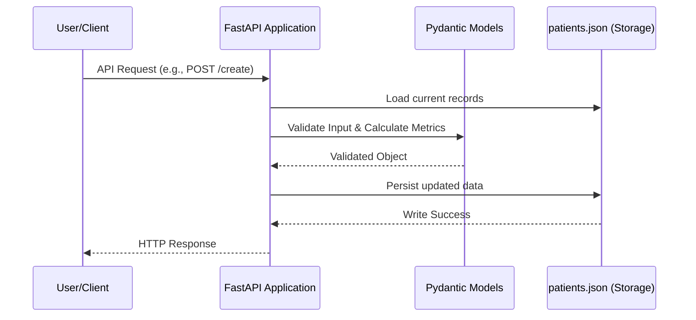

# Patient Management System (FastAPI)

A robust FastAPI-based backend service for managing patient records. This project demonstrates modern development practices including containerization with Docker and orchestration using Kubernetes (Kind).

## Overview

The Patient Management System provides a suite of RESTful APIs to manage patient data stored in a JSON-based persistence layer. It features automated health metrics calculation (BMI and Health Verdict) and is designed for high availability within a Kubernetes environment.

## Key Features

- **Automated Calculations:** Real-time BMI and health verdict generation using Pydantic computed fields.
- **Full CRUD Support:** Complete lifecycle management for patient records.
- **Advanced Querying:** Support for sorting by physical metrics (height, weight, BMI).
- **High Availability:** Configurable Kubernetes deployment with horizontal scaling and Pod Disruption Budgets (PDB).
- **Containerized Architecture:** Fully Dockerized for consistent development and production parity.

## Architecture

The system is architected as a containerized microservice running within a Kubernetes cluster.



## System Workflow

The diagram below illustrates the sequence of operations for data persistence and validation.



## Getting Started

### Local Development

1. **Install Dependencies:**
   ```bash
   pip install -r requirements.txt
   ```

2. **Execute Application:**
   ```bash
   uvicorn main:app --reload --host 0.0.0.0 --port 8000
   ```
   The API will be accessible at `http://localhost:8000`.

### Docker Execution

1. **Build the Image:**
   ```bash
   docker build -t fastapi-app:v1.0 .
   ```

2. **Run the Container:**
   ```bash
   docker run -p 8000:8000 fastapi-app:v1.0
   ```

## Kubernetes Deployment

The project includes manifests for deploying to a local **Kind** cluster.

1. **Initialize Cluster & Load Image:**
   ```bash
   kind create cluster --config kind-config.yaml
   kind load docker-image fastapi-app:v1.0
   ```

2. **Apply Manifests:**
   ```bash
   kubectl apply -f deployment.yaml
   kubectl apply -f service.yaml
   kubectl apply -f pdb.yaml
   kubectl apply -f hpa.yaml
   ```

3. **Horizontal Pod Autoscaling (HPA):**
   HPA requires a metrics server. In Kind, you can install it using:
   ```bash
   kubectl apply -f https://github.com/kubernetes-sigs/metrics-server/releases/latest/download/components.yaml
   ```
   *Note: You may need to patch the metrics-server to allow insecure TLS for Kind nodes:*
   ```bash
   kubectl patch deployment metrics-server -n kube-system --type='json' -p='[{"op": "add", "path": "/spec/template/spec/containers/0/args/-", "value": "--kubelet-insecure-tls"}]'
   ```
   Verify HPA status:
   ```bash
   kubectl get hpa
   ```

4. **Access the Service:**
   ```bash
   kubectl port-forward service/fastapi-service 8000:80
   ```

## Stress Testing & Horizontal Scaling

To observe the Horizontal Pod Autoscaler in action, you can perform a stress test that bombards the service with requests.

### 1. Watch in Real-Time
Open two dedicated terminal windows to monitor the scaling process:

- **Monitor HPA Metrics:**
  ```bash
  kubectl get hpa fastapi-hpa --watch
  ```
- **Monitor Pod Status:**
  ```bash
  kubectl get pods -l app=fastapi --watch
  ```

### 2. Run the Stress Test
Execute the provided Python script to generate high traffic. This will increase CPU utilization and trigger the HPA to spin up more pods.

- **Ensure Port-Forward is Running:**
  ```bash
  kubectl port-forward service/fastapi-service 8000:80
  ```
- **Execute Script:**
  ```bash
  python test.py
  ```

### 3. Observe the Results
As the CPU usage exceeds the 50% threshold defined in `hpa.yaml`, you will see:
1. The `TARGETS` column in the HPA watch update to show higher utilization.
2. New pods being created in the Pod watch (up to `maxReplicas: 5`).
3. Once the script is stopped, the pods will eventually scale back down to `minReplicas` after the cooldown period.

## API Reference

| Method | Endpoint | Description |
| :--- | :--- | :--- |
| `GET` | `/` | Service health check / Welcome |
| `GET` | `/about` | Service metadata |
| `GET` | `/view` | Retrieve all patient records |
| `GET` | `/patient/{id}` | Retrieve a specific patient record |
| `GET` | `/sort` | Sort patients by `height`, `weight`, or `bmi` |
| `POST` | `/create` | Register a new patient |
| `PUT` | `/edit/{id}` | Update existing patient details |
| `DELETE` | `/delete/{id}` | Remove a patient record |

## Scalability and Availability

The service is configured to run with multiple replicas (default: 3) to ensure redundancy.

### Scaling the Deployment
To adjust the number of active instances:
```bash
kubectl scale deployment fastapi-app --replicas=5
```

### Health Probes
Kubernetes utilizes Liveness and Readiness probes (configured in `deployment.yaml`) to monitor pod health and manage traffic routing effectively.
