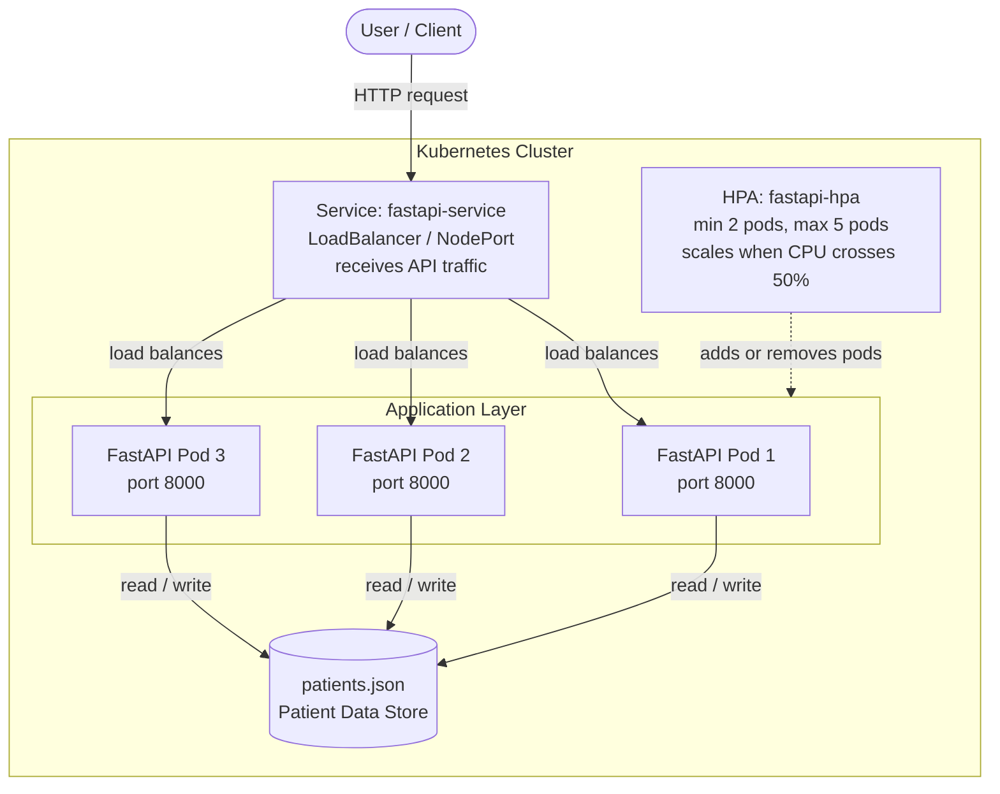
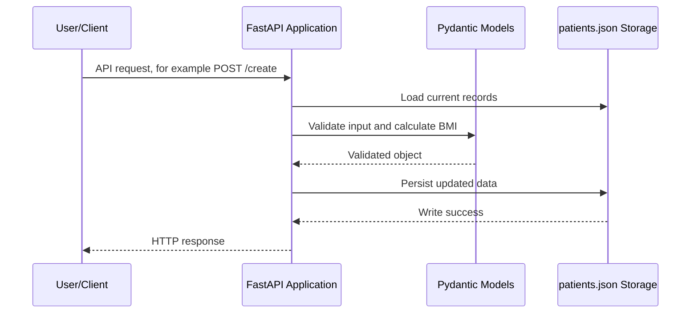
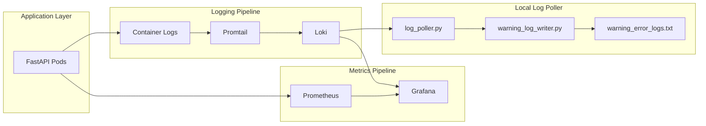

# Patient Management System

A simple FastAPI patient records API running on Kubernetes with autoscaling, Grafana/Prometheus monitoring, Loki logs, and a small Python log poller for warning/error logs.

## What This Project Has

- FastAPI backend for patient records
- Docker image: `fastapi-app:v1.0`
- Kubernetes Deployment, Service, HPA, and PDB
- Grafana + Prometheus for stats
- Loki + Promtail for logs
- `log_poller.py` to poll Loki every 5 seconds
- `warning_log_writer.py` to save warning/error logs into `warning_error_logs.txt`

## Architecture

The system is architected as a containerized FastAPI microservice running inside a Kubernetes cluster.



## System Workflow

The request flow below shows how patient data is validated, stored, and returned.



## Monitoring Flow



## Main Files

| File | Use |
| :--- | :--- |
| `main.py` | FastAPI app |
| `deployment.yaml` | Runs FastAPI pods |
| `service.yaml` | Exposes the app |
| `hpa.yaml` | Autoscaling rules |
| `test.py` | Stress test for HPA |
| `log_poller.py` | Reads latest logs from Loki |
| `warning_log_writer.py` | Writes warning/error logs to file |

## Run Locally

```bash
pip install -r requirements.txt
uvicorn main:app --reload --host 0.0.0.0 --port 8000
```

Open:

```text
http://localhost:8000
```

Docs:

```text
http://localhost:8000/docs
```

## Run On Kubernetes

Build and load image:

```bash
docker build -t fastapi-app:v1.0 .
kind load docker-image fastapi-app:v1.0
```

Apply manifests:

```bash
kubectl apply -f deployment.yaml
kubectl apply -f service.yaml
kubectl apply -f pdb.yaml
kubectl apply -f hpa.yaml
```

Check everything:

```bash
kubectl get pods
kubectl get svc
kubectl get hpa
```

## Access The API

Port-forward:

```bash
kubectl port-forward service/fastapi-service 8000:80
```

Then open:

```text
http://localhost:8000
```

If using NodePort:

```text
http://localhost:30080
```

If using MetalLB, check the external IP:

```bash
kubectl get svc fastapi-service
```

Then open:

```text
http://<EXTERNAL-IP>
```

## API Endpoints

| Method | Endpoint | Purpose |
| :--- | :--- | :--- |
| `GET` | `/` | Health check |
| `GET` | `/view` | Show all patients |
| `GET` | `/patient/{id}` | Show one patient |
| `GET` | `/sort?sort_by=bmi&order=asc` | Sort patients |
| `POST` | `/create` | Create patient |
| `PUT` | `/edit/{id}` | Update patient |
| `DELETE` | `/delete/{id}` | Delete patient |

## See Stats

Watch HPA:

```bash
kubectl get hpa fastapi-hpa --watch
```

Watch pods scale:

```bash
kubectl get pods -l app=fastapi --watch
```

See CPU/memory:

```bash
kubectl top pods
kubectl top nodes
```

Run stress test:

```bash
python3 test.py
```

## Open Grafana

Port-forward Grafana:

```bash
kubectl port-forward -n monitoring svc/kube-prometheus-stack-grafana 3000:80
```

Open:

```text
http://localhost:3000
```

Use Grafana dashboards for Prometheus stats.

## See Logs In Grafana

Go to:

```text
Grafana -> Explore -> Loki -> Code
```

Use these queries:

```logql
{namespace="default"}
```

FastAPI only:

```logql
{namespace="default", app="fastapi"}
```

Warning/error only:

```logql
{namespace="default"} |~ "(?i)error|warning|warn|failed|exception"
```

## Run The Log Poller

Port-forward Loki:

```bash
kubectl port-forward -n monitoring svc/loki 3100:3100
```

Run:

```bash
python3 log_poller.py
```

It prints the latest 5 logs every 5 seconds.

If any log contains `error`, `warning`, `failed`, or `exception`, it writes it to:

```text
warning_error_logs.txt
```

## Test Warning/Error Logs

Create a test pod:

```bash
kubectl run log-test --image=busybox --restart=Never -- /bin/sh -c 'echo "ERROR test log from busybox"; echo "WARNING test warning from busybox"; sleep 10'
```

Check in Grafana:

```logql
{pod="log-test"}
```

Delete test pod:

```bash
kubectl delete pod log-test
```

## Quick Commands

```bash
kubectl get pods
kubectl get svc
kubectl get hpa
kubectl logs -l app=fastapi
python3 log_poller.py
python3 test.py
```
